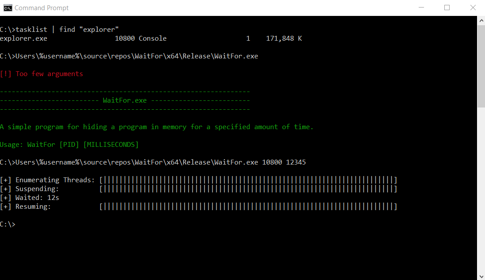

# WaitFor
A simple program to hide a process in memory for a specified amount of time by using `SuspendThread` then `VirtualProtectEx`

## Build
Use visual studio 2019

## Usage
```
WaitFor.exe [PID] [MILLISECONDS]
```


## Explanation
* Enumerates threads of the target process, suspends them then changes the memory permissions to `PAGE_NOACCESS`
* Waits a specified amount of time (maximum is nearly 50 days)
* Changes memory permissions for the threads back to `PAGE_EXECUTE_READWRITE` and resumes them

## Todo
* Add process injection
* Make stuff optionally asynchronous
